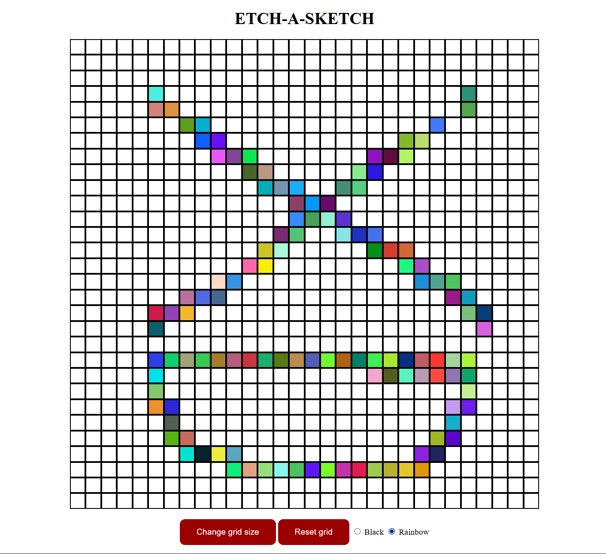

# Etch-a-Sketch
This is a simple browser based Etch a Sketch application based on the Odin project using HTML, CSS and Javascript. Users are able to draw on a grid with variable size by hovering over them, and being able to choose between different colours. It is a very good exercise for DOM manipulation in particular.

## Features
* **Dynamic Grids**: Defaulted to a 16x16 grid, but users are able to customise up to 100x100.
* **Hover Drawing**: users are able to draw by simply hovering their mouse over each square. Users can colour in black or rainbow
* **Responsive grid sizing**: The space the grid takes is static, and the amount of squares change size to accommodate the size of the space.

## Demo Screenshot
